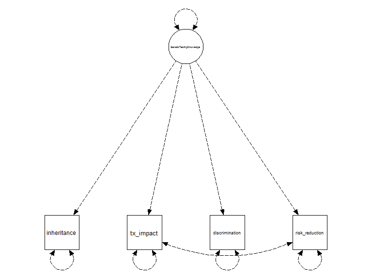
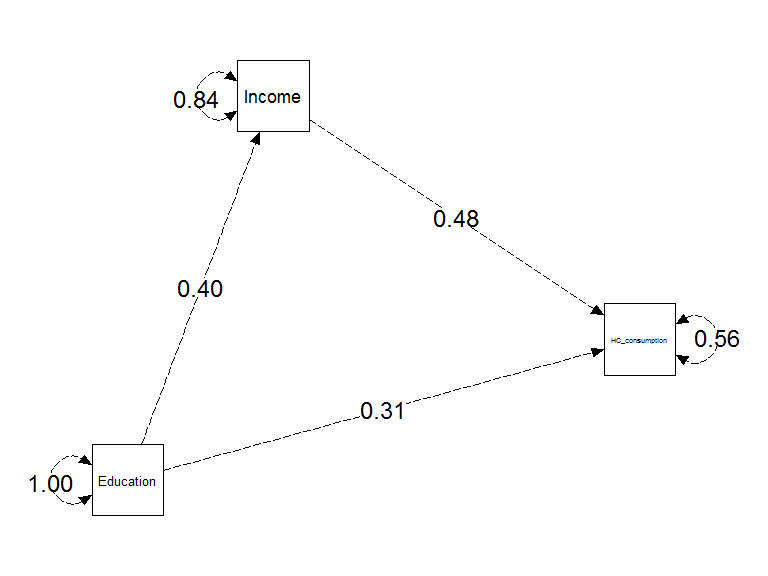
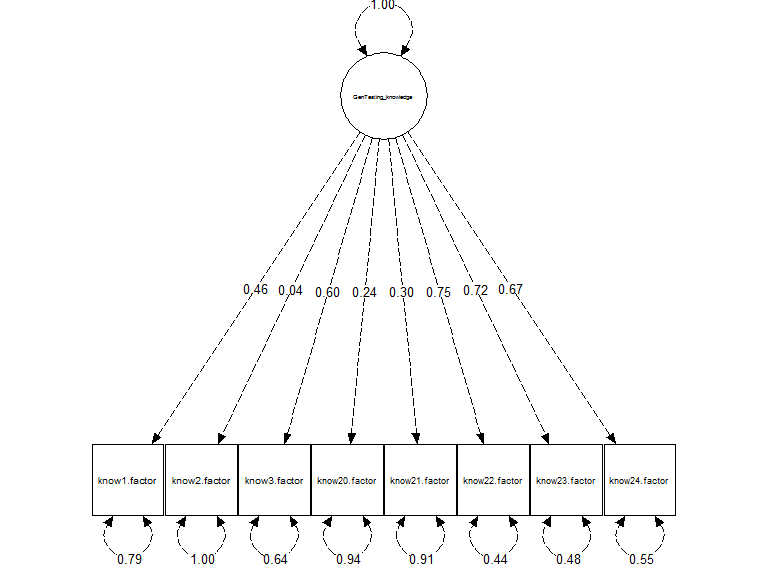
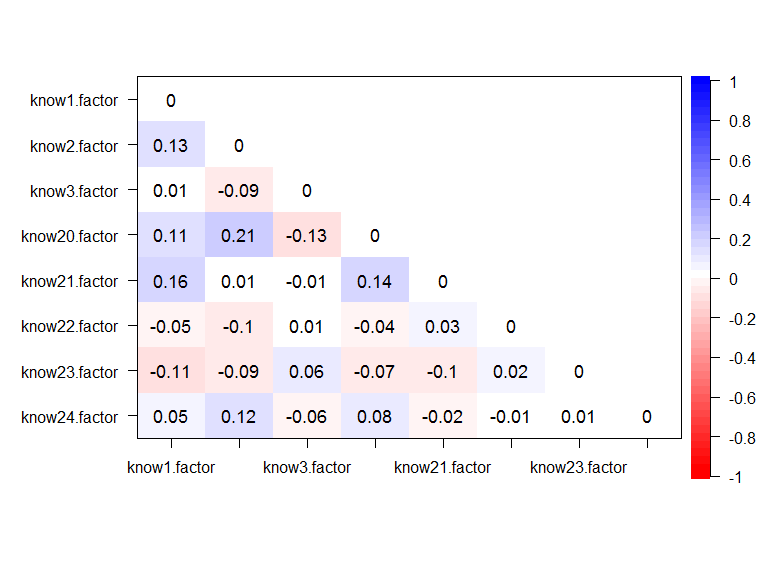
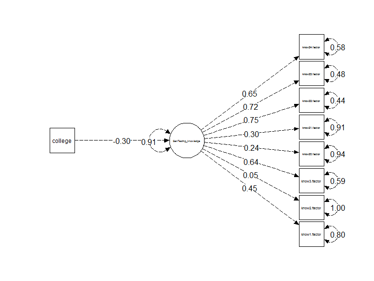

# Introduction to Structural Equation Modeling with R
Daniel Gundersen, PhD<br/>DanielA_Gundersen@dfci.harvard.edu<br/>Survey and Data Management Core<br/>Dana-Farber Cancer Institute  
September 28, 2017  


## Overview/Agenda

1. Key concepts and terms
2. Model identification and estimation
3. R and the lavaan package
4. Overview of models:
      - Path models
      - Measurement/Latent variable models
      - Combining measurement variable and path models
      
## Learning Objectives

1. Describe key terms in structural equation modeling (SEM)
2. Identify analytic goals and data that lend themselves to SEM
3. Write out SEM model in equation and graphical form
4. Interpret and assess models

## Key concepts and terms
- Structural Equation Modeling (SEM):
      - General framework for fitting (often complex) statistical models
      - Many familiar models are special cases of SEM
      - Flexible in allowing constraints on parameter estimates
- Common analyses:
      - Relate $\geq1$ dependent to $\geq1$ independent variables
      - Confirm a hypothesized causal mechanism
      - Confirm a latent variable measurement model

## Key concepts and terms
- Measurement model: relates manifest variables to latent construct

- Structural Model: relates constructs to other constructs

- Mediation: Effect of an independent variable on a dependent variable operates through its effect on an intermediate variable

- Moderation: Effect of an independent variable on a dependent variable is different at levels of a third variable

## Graphical model presentation {.center}
<!-- -->

## Writing model in equation form
- General Notation (measurement model):

$$
\begin{align}
y_{i1} = v_{1} + \lambda_{1k}\eta_{i1} +&... + \lambda_{1m}\eta_{im} + e_{i1} \\
&\vdots \\
y_{ij} = v_{j} + \lambda_{j1}\eta_{i1} +&... + \lambda_{jm}\eta_{im} + e_{ij} \\
\end{align}
$$
(notation varies by software and text books)

## Writing model in equation form
- Preceding model:

$$
\begin{align}
inheritance = v_1 + \lambda_{1} genetic\_testing\_knowledge + e_{i1} \\

tx\_impact = v_2 + \lambda_{2} genetic\_testing\_knowledge + e_{i2} \\

discrimination = v_3 + \lambda_{3} genetic\_testing\_knowledge + e_{i3} \\

risk\_reduction = v_4 + \lambda_{4} genetic\_testing\_knowledge + e_{i4}
\end{align}
$$

## Writing model in equation form
- In software, the model is often written:
$$
\begin{align}
latent_1 \space \left< operator \right> \space man&ifest_{1,1} + ... + manifest_{j,1} \\
&\vdots \\
latent_m \space \left< operator \right> \space man&ifest_{j,m} + ... + manifest_{k,m} \\
\end{align}
$$
- 'operator' indicates unique symbols for regress, variance/covariance, and latent measures

- Genetic testing knowledge:

$$
\begin{align}
Gx\_testing\_know \space \left< operator \right> \space inherit + tx\_impact + discrim + risk\_reduc
\end{align}
$$

## Model identification
- Latent variables do not have a natural unit of measurement
- Constrain one parameter to identify the model
      - Usually, the first path coefficient, $\lambda$, is constrained to 1
      - Alternatively, constrain variance of latent variable to 1

## Estimation 
- Maximum likelihood:
      - Assumes conditional multivariate normality (MVN) 
      - Bootstrapping or adjustments to Chi2 value (Satorra-Bentler) and standard errors can adjust bias in standard errors and confidence intervals in presence of non-normality
- Asymptotic Distribution Free/Weighted Least Squares:
      - Uses a weighting matrix in the fitting function to adjust for non-normality
      - Variations inlude means- or means and variance adjusted WLS to produce robust standard errors, and Diagnoally WLS to reduce computation

## Assessing model fit
- Chi2 goodness of fit:
      - compares estimated model against a "saturated" model
      - if model is not statistically different, it can be regarded as a good fitting model
      - null hypothesis is equal fit of analytic and saturated models
      - Strongly influenced by sample size

- Tucker Lewis and Comparative Fit Indices:
      - analogous to R-squared
      - compares fit in observed model to "null" model
      - ranges from 0 to 1
      - descriptive; guides for good fit is >0.90 or >0.95

## Assessing model fit
- Standardized Root Mean Square Residual (SRMR) 
      - standardized difference between observed and model implied correlations
      - 0 indicates perfect fit, <0.08 usually considered good

- Root Mean Square Error of Approximation (RMSEA)
      - calculated based on non-centrality parameter
      - 0 indicates perfect fit, <0.06, <0.08, and <0.10 common cut-off values
      - can generate confidence intervals, or test RMSEA<0.08 (or other value)

## Assessing model fit
- Inspect residual covariance or correlation matrix: 
$$
\begin{align}
\mathbf{R_{resid} = R_{observed} - R_{modelimplied}}
\end{align}
$$

   - Large residual covariance among item pairs indicates lack of fit
      
- Inspect modification indices or LR-Chi2 test of nested models
      - MI is estimated change in model-Chi2 by allowing parameter to be estimated
      - LR-Chi2 gives significance test on path coefficients

## R and the lavaan package
- R is open source statistical programming software
- A number of statistial functions included in base
- Several user written packages for specialized analyses can be installed (or written)

- 'lavaan' package:
      - R package for fitting structural equation models
      - developed by Yves Rosseel at Ghent University
      
## Path models:
- Causal model without latent variables
- Hypothesize effect of education on health care consumption is mediated by income


```r
cor_mat2 <- matrix(c(1.0, 0.4, 0.5,
                    0.4, 1.0, 0.6, 
                    0.5, 0.6, 1.0),
                   3,3)

colnames(cor_mat2) <- c("Education", "Income", "HC_consumption")
rownames(cor_mat2) <- c("Education", "Income", "HC_consumption")
```


```r
psych::lowerMat(cor_mat2)
```

```
##                Edctn Incom HC_cn
## Education      1.0              
## Income         0.4   1.0        
## HC_consumption 0.5   0.6   1.0
```

## Path models: 

- write out and fit the model


```r
library(lavaan)
model <- '# Direct effect
            HC_consumption ~ c*Education
          
          # Mediation
            Income ~ a*Education
            HC_consumption ~ b*Income
            
          # Indirect effect
            ab := a*b

          # Total effect
            total := c + (a*b)
         '
path_fit <- sem(model, sample.cov=cor_mat2, sample.nobs = 551, 
                estimator="ML")
```

## Path models: {.smaller}

```r
summary(path_fit)
```

```
## lavaan (0.5-23.1097) converged normally after  11 iterations
## 
##   Number of observations                           551
## 
##   Estimator                                         ML
##   Minimum Function Test Statistic                0.000
##   Degrees of freedom                                 0
## 
## Parameter Estimates:
## 
##   Information                                 Expected
##   Standard Errors                             Standard
## 
## Regressions:
##                    Estimate  Std.Err  z-value  P(>|z|)
##   HC_consumption ~                                    
##     Education  (c)    0.310    0.035    8.902    0.000
##   Income ~                                            
##     Education  (a)    0.400    0.039   10.245    0.000
##   HC_consumption ~                                    
##     Income     (b)    0.476    0.035   13.696    0.000
## 
## Variances:
##                    Estimate  Std.Err  z-value  P(>|z|)
##    .HC_consumption    0.559    0.034   16.598    0.000
##    .Income            0.838    0.051   16.598    0.000
## 
## Defined Parameters:
##                    Estimate  Std.Err  z-value  P(>|z|)
##     ab                0.190    0.023    8.204    0.000
##     total             0.500    0.037   13.552    0.000
```

## Path Models

```r
library(semPlot)

semPaths(path_fit, "std", rotation = 2, nCharNodes = 0, layout = "spring", 
         edge.label.cex=1.5, levels = c(1,2,3), sizeLat = 10, weighted = F,
         sizeMan=10, fixedStyle = c("black", 5), freeStyle = c("black", 5))
```

<!-- -->

## Measurement (latent variable) model

- Hypothesize a unidimensional model, where knowledge of multi-panel gene testing determines responses to manifest items


```r
library(lavaan)

knowledge_mod <-  '
                  GenTesting_knowledge =~ know1.factor + know2.factor + 
                  know3.factor + know20.factor + know21.factor + 
                  know22.factor + know23.factor + know24.factor
                  '
cfa_fit <- cfa(knowledge_mod, data = know_micra.df, estimator = "WLSMV")
```

## Measurement (latent variable) model {.smaller}

```r
summary(cfa_fit)
```

```
## lavaan (0.5-23.1097) converged normally after  30 iterations
## 
##                                                   Used       Total
##   Number of observations                           521         551
## 
##   Estimator                                       DWLS      Robust
##   Minimum Function Test Statistic               37.730      49.018
##   Degrees of freedom                                20          20
##   P-value (Chi-square)                           0.010       0.000
##   Scaling correction factor                                  0.787
##   Shift parameter                                            1.050
##     for simple second-order correction (Mplus variant)
## 
## Parameter Estimates:
## 
##   Information                                 Expected
##   Standard Errors                           Robust.sem
## 
## Latent Variables:
##                           Estimate  Std.Err  z-value  P(>|z|)
##   GenTesting_knowledge =~                                    
##     know1.factor             1.000                           
##     know2.factor             0.095    0.157    0.606    0.544
##     know3.factor             1.309    0.315    4.152    0.000
##     know20.factor            0.512    0.182    2.808    0.005
##     know21.factor            0.650    0.189    3.429    0.001
##     know22.factor            1.623    0.377    4.301    0.000
##     know23.factor            1.574    0.381    4.136    0.000
##     know24.factor            1.465    0.346    4.228    0.000
## 
## Intercepts:
##                    Estimate  Std.Err  z-value  P(>|z|)
##    .know1.factor      0.000                           
##    .know2.factor      0.000                           
##    .know3.factor      0.000                           
##    .know20.factor     0.000                           
##    .know21.factor     0.000                           
##    .know22.factor     0.000                           
##    .know23.factor     0.000                           
##    .know24.factor     0.000                           
##     GnTstng_knwldg    0.000                           
## 
## Thresholds:
##                    Estimate  Std.Err  z-value  P(>|z|)
##     know1.factr|t1    1.376    0.079   17.471    0.000
##     know2.factr|t1   -0.065    0.055   -1.182    0.237
##     know3.factr|t1    0.871    0.063   13.768    0.000
##     know20.fctr|t1    0.065    0.055    1.182    0.237
##     know21.fctr|t1   -0.424    0.057   -7.460    0.000
##     know22.fctr|t1    0.928    0.065   14.395    0.000
##     know23.fctr|t1    0.240    0.056    4.329    0.000
##     know24.fctr|t1    0.543    0.058    9.356    0.000
## 
## Variances:
##                    Estimate  Std.Err  z-value  P(>|z|)
##    .know1.factor      0.788                           
##    .know2.factor      0.998                           
##    .know3.factor      0.637                           
##    .know20.factor     0.945                           
##    .know21.factor     0.911                           
##    .know22.factor     0.443                           
##    .know23.factor     0.476                           
##    .know24.factor     0.546                           
##     GnTstng_knwldg    0.212    0.094    2.251    0.024
## 
## Scales y*:
##                    Estimate  Std.Err  z-value  P(>|z|)
##     know1.factor      1.000                           
##     know2.factor      1.000                           
##     know3.factor      1.000                           
##     know20.factor     1.000                           
##     know21.factor     1.000                           
##     know22.factor     1.000                           
##     know23.factor     1.000                           
##     know24.factor     1.000
```

## Measurement (latent variable) model {.smaller}

```r
standardizedsolution(cfa_fit)
```

```
##                     lhs  op                  rhs est.std    se      z
## 1  GenTesting_knowledge  =~         know1.factor   0.460 0.102  4.502
## 2  GenTesting_knowledge  =~         know2.factor   0.044 0.072  0.610
## 3  GenTesting_knowledge  =~         know3.factor   0.602 0.067  9.038
## 4  GenTesting_knowledge  =~        know20.factor   0.236 0.069  3.418
## 5  GenTesting_knowledge  =~        know21.factor   0.299 0.066  4.547
## 6  GenTesting_knowledge  =~        know22.factor   0.747 0.065 11.448
## 7  GenTesting_knowledge  =~        know23.factor   0.724 0.058 12.503
## 8  GenTesting_knowledge  =~        know24.factor   0.674 0.059 11.370
## 9          know1.factor   |                   t1   1.376 0.079 17.471
## 10         know2.factor   |                   t1  -0.065 0.055 -1.182
## 11         know3.factor   |                   t1   0.871 0.063 13.768
## 12        know20.factor   |                   t1   0.065 0.055  1.182
## 13        know21.factor   |                   t1  -0.424 0.057 -7.460
## 14        know22.factor   |                   t1   0.928 0.065 14.395
## 15        know23.factor   |                   t1   0.240 0.056  4.329
## 16        know24.factor   |                   t1   0.543 0.058  9.356
## 17         know1.factor  ~~         know1.factor   0.788 0.000     NA
## 18         know2.factor  ~~         know2.factor   0.998 0.000     NA
## 19         know3.factor  ~~         know3.factor   0.637 0.000     NA
## 20        know20.factor  ~~        know20.factor   0.945 0.000     NA
## 21        know21.factor  ~~        know21.factor   0.911 0.000     NA
## 22        know22.factor  ~~        know22.factor   0.443 0.000     NA
## 23        know23.factor  ~~        know23.factor   0.476 0.000     NA
## 24        know24.factor  ~~        know24.factor   0.546 0.000     NA
## 25 GenTesting_knowledge  ~~ GenTesting_knowledge   1.000 0.000     NA
## 26         know1.factor ~*~         know1.factor   1.000 0.000     NA
## 27         know2.factor ~*~         know2.factor   1.000 0.000     NA
## 28         know3.factor ~*~         know3.factor   1.000 0.000     NA
## 29        know20.factor ~*~        know20.factor   1.000 0.000     NA
## 30        know21.factor ~*~        know21.factor   1.000 0.000     NA
## 31        know22.factor ~*~        know22.factor   1.000 0.000     NA
## 32        know23.factor ~*~        know23.factor   1.000 0.000     NA
## 33        know24.factor ~*~        know24.factor   1.000 0.000     NA
## 34         know1.factor  ~1                        0.000 0.000     NA
## 35         know2.factor  ~1                        0.000 0.000     NA
## 36         know3.factor  ~1                        0.000 0.000     NA
## 37        know20.factor  ~1                        0.000 0.000     NA
## 38        know21.factor  ~1                        0.000 0.000     NA
## 39        know22.factor  ~1                        0.000 0.000     NA
## 40        know23.factor  ~1                        0.000 0.000     NA
## 41        know24.factor  ~1                        0.000 0.000     NA
## 42 GenTesting_knowledge  ~1                        0.000 0.000     NA
##    pvalue
## 1   0.000
## 2   0.542
## 3   0.000
## 4   0.001
## 5   0.000
## 6   0.000
## 7   0.000
## 8   0.000
## 9   0.000
## 10  0.237
## 11  0.000
## 12  0.237
## 13  0.000
## 14  0.000
## 15  0.000
## 16  0.000
## 17     NA
## 18     NA
## 19     NA
## 20     NA
## 21     NA
## 22     NA
## 23     NA
## 24     NA
## 25     NA
## 26     NA
## 27     NA
## 28     NA
## 29     NA
## 30     NA
## 31     NA
## 32     NA
## 33     NA
## 34     NA
## 35     NA
## 36     NA
## 37     NA
## 38     NA
## 39     NA
## 40     NA
## 41     NA
## 42     NA
```

## Measurement (latent variable) model

```r
semPaths(cfa_fit, what = "path", whatLabels = "std", nCharNodes = 0, 
         sizeLat = 12, sizeMan = 10, fixedStyle = c("black", 5), 
         edge.label.cex = 0.8, thresholds = F, intercepts = F, 
         freeStyle = c("black", 5), weighted = F)
```

<!-- -->


## Measurement (latent variable) model 

```r
fit_ms <- fitMeasures(cfa_fit)
round(fit_ms["cfi.scaled"], 3)
```

```
## cfi.scaled 
##      0.917
```

```r
round(fit_ms["rmsea.scaled"], 3)
```

```
## rmsea.scaled 
##        0.053
```

```r
semTools::nullRMSEA(cfa_fit)
```

```
## Baseline RMSEA: 0.168
```

## Measurement (latent variable) model

```r
resid_r <- resid(cfa_fit)$cov
psych::corPlot(resid_r, upper=F, numbers = T)
```

<!-- -->

## Measurement Model {.smaller}

```r
mod_ind <- modificationindices(cfa_fit)
head(mod_ind[order(mod_ind$mi, decreasing=TRUE), ], 5)
```

```
##              lhs op           rhs    mi mi.scaled    epc sepc.lv sepc.all
## 51  know2.factor ~~ know20.factor 9.967    12.672  0.214   0.214    0.214
## 61 know20.factor ~~ know21.factor 4.451     5.658  0.152   0.152    0.152
## 55  know2.factor ~~ know24.factor 3.488     4.435  0.152   0.152    0.152
## 56  know3.factor ~~ know20.factor 3.319     4.220 -0.159  -0.159   -0.159
## 66 know21.factor ~~ know23.factor 2.687     3.416 -0.144  -0.144   -0.144
##    sepc.nox
## 51    0.214
## 61    0.152
## 55    0.152
## 56   -0.159
## 66   -0.144
```

- MI ~ Chi2, df=1
- At alpha = 0.05, critical value = 8.28, after adjusting for multiple comparisons

- Remediation options: 
      - free one residual covariances to be estimated, if interpretable
      - eliminate one of the "offending"" variables and refit model 
      - leave as is if (1) both variables are crucial for content validity 
      - leave as is if eliminating item does not substantively alter interpretation

## Combining Path and Measurement Model

- Hypothesize college educated have greater knowledge, on average, than those without college degree


```r
model <-    '
            # Genetic knowledge measurement
            GenTesting_knowledge =~ know1.factor + know2.factor + know3.factor +
            know20.factor + know21.factor + know22.factor + know23.factor + 
            know24.factor

            # structural model
            GenTesting_knowledge ~ college
            '
sem_fit <- sem(model, data = know_micra.df, estimator = "WLSMV")
```

## Combining Path and Measurement Model {.smaller}

```r
summary(sem_fit)
```

```
## lavaan (0.5-23.1097) converged normally after  29 iterations
## 
##                                                   Used       Total
##   Number of observations                           502         551
## 
##   Estimator                                       DWLS      Robust
##   Minimum Function Test Statistic               43.654      53.177
##   Degrees of freedom                                27          27
##   P-value (Chi-square)                           0.022       0.002
##   Scaling correction factor                                  0.846
##   Shift parameter                                            1.597
##     for simple second-order correction (Mplus variant)
## 
## Parameter Estimates:
## 
##   Information                                 Expected
##   Standard Errors                           Robust.sem
## 
## Latent Variables:
##                           Estimate  Std.Err  z-value  P(>|z|)
##   GenTesting_knowledge =~                                    
##     know1.factor             1.000                           
##     know2.factor             0.101    0.163    0.616    0.538
##     know3.factor             1.445    0.363    3.978    0.000
##     know20.factor            0.520    0.194    2.681    0.007
##     know21.factor            0.666    0.203    3.283    0.001
##     know22.factor            1.691    0.410    4.125    0.000
##     know23.factor            1.636    0.416    3.931    0.000
##     know24.factor            1.462    0.363    4.032    0.000
## 
## Regressions:
##                          Estimate  Std.Err  z-value  P(>|z|)
##   GenTesting_knowledge ~                                    
##     college                -0.318    0.091   -3.504    0.000
## 
## Intercepts:
##                    Estimate  Std.Err  z-value  P(>|z|)
##    .know1.factor      0.000                           
##    .know2.factor      0.000                           
##    .know3.factor      0.000                           
##    .know20.factor     0.000                           
##    .know21.factor     0.000                           
##    .know22.factor     0.000                           
##    .know23.factor     0.000                           
##    .know24.factor     0.000                           
##    .GnTstng_knwldg    0.000                           
## 
## Thresholds:
##                    Estimate  Std.Err  z-value  P(>|z|)
##     know1.factr|t1    1.004    0.321    3.124    0.002
##     know2.factr|t1   -0.293    0.242   -1.214    0.225
##     know3.factr|t1   -0.414    0.250   -1.656    0.098
##     know20.fctr|t1   -0.344    0.241   -1.425    0.154
##     know21.fctr|t1   -1.014    0.261   -3.885    0.000
##     know22.fctr|t1    0.340    0.264    1.286    0.199
##     know23.fctr|t1   -0.764    0.242   -3.150    0.002
##     know24.fctr|t1    0.057    0.247    0.229    0.819
## 
## Variances:
##                    Estimate  Std.Err  z-value  P(>|z|)
##    .know1.factor      0.813                           
##    .know2.factor      0.998                           
##    .know3.factor      0.609                           
##    .know20.factor     0.949                           
##    .know21.factor     0.917                           
##    .know22.factor     0.465                           
##    .know23.factor     0.500                           
##    .know24.factor     0.601                           
##    .GnTstng_knwldg    0.187    0.088    2.118    0.034
## 
## Scales y*:
##                    Estimate  Std.Err  z-value  P(>|z|)
##     know1.factor      1.000                           
##     know2.factor      1.000                           
##     know3.factor      1.000                           
##     know20.factor     1.000                           
##     know21.factor     1.000                           
##     know22.factor     1.000                           
##     know23.factor     1.000                           
##     know24.factor     1.000
```

## Combining Path and Measurement Model

```r
semPaths(sem_fit, what = "path", whatLabels = "std", nCharNodes = 0,
         sizeMan = 7, sizeLat = 10, rotation = 2, 
         edge.label.cex=1, thresholds = F, intercepts = F,
         fixedStyle = c("black", 5), freeStyle = c("black", 5))
```

<!-- -->


## Additional resources
- R: 
      - http://www.r-project.org
      - http://www.RStudio.org
      
- Lavaan:
      - http://lavaan.ugent.be/
      - Yves Rosseel (2012). lavaan: An R Package for Structural Equation Modeling. Journal of Statistical Software, 48(2), 1-36. URL http://www.jstatsoft.org/v48/i02/
      
- Confirmatory Factor Analysis:

      - Brown, T.A., 2014. Confirmatory factor analysis for applied research. Guilford Publications.

- Structural Equation Modeling:
      - Hox, J.J. and Bechger, T.M., 2007. An introduction to structural equation modeling.
      - R packages: https://cran.r-project.org/web/views/Psychometrics.html
      - Lisrel
      - Mplus 
      - EQS
      - Stata
      - SAS
      - SPSS AMOS
      - MPlus and Stata have instructive reference manuals for SEM
      - http://lavaan.ugent.be/ has good examples

